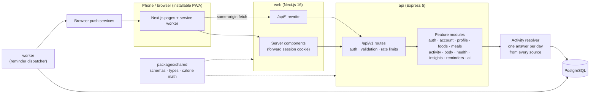

# NutriCoach — AI Nutrition & Fitness Coach

A mobile-first, installable web app (PWA) for tracking food, workouts, water, steps and weight, with an
end-of-day "eaten vs burned" view, progress charts, reminders and a built-in AI coach. Tuned for Indian food.

## Architecture



| Package | What it owns |
|---|---|
| `packages/shared` | Zod request schemas, response types, option labels, and all nutrition/energy math. The single contract used by the API, the web app and any future mobile app. |
| `api` | REST API (`/api/v1`), Prisma/Postgres, auth, business rules. Feature modules live in `api/src/modules/<feature>/` as `*.routes.ts` (HTTP) + `*.service.ts` (logic). |
| `api` worker | `api/src/worker.ts` — a separate process that sends reminders. Safe to run several replicas: each reminder is claimed atomically per day. |
| `web` | Next.js UI only (no DB access). Server components call the API with the user's cookie; the browser calls it through the `/api/*` rewrite so auth stays same-origin. |

Key design decisions:

- **Nutrition is never invented.** AI providers only *extract* food mentions or *propose* meals; foods and macros always come from the database and the user confirms before saving.
- **Targets follow your current weight.** Calorie and protein goals are derived at read time from the latest weigh-in, not stored.
- **History is immutable.** Meal items and workouts snapshot calories at log time; editing a food or your weight never rewrites the past. Custom foods already logged are archived, not deleted.
- **Sessions can be revoked.** JWTs carry a `tokenVersion`; changing or resetting a password signs out other devices.
- **Timezone-correct days.** "Today" is computed in the user's timezone (captured at onboarding), never UTC.
- **Nothing is counted twice.** Steps, workouts and any connected device all describe the same day. The resolver in
  `api/src/modules/health/` picks a single source for steps (the most trustworthy one that has data, never a sum),
  subtracts the steps a logged walk or run already accounts for, and counts a device's active energy only beyond the
  workouts you logged yourself. `DailyActivity` caches the result; it holds nothing that can't be recomputed, so every
  write simply drops the affected rows.

## Features

- Sign up, onboarding wizard, forgot/reset password, change email/password, delete account
- Food logging: search (trigram-indexed), recent, favourites, your own foods (per 100 g or per serving), edit amounts, copy yesterday's meals, log past days
- **Describe a meal** (typed or spoken): "2 chapatis, 1 katori dal and a glass of milk" → matched foods with grams to review
- Meal ideas that fit your remaining calories, protein and diet
- Workouts from 34 activities (MET-based burn using your weight), steps, water, weigh-ins
- **Heart points** scored by intensity, the way the WHO writes its guideline: a point per moderate minute, two per
  vigorous minute, 150 a week. Earned from workouts, from measured walking cadence, or estimated from a daily step count
- Movement goals for steps, move calories, heart points a week and active days a week, seeded from your activity level
  and raised when you've outgrown them
- Today dashboard with three goal rings and weekly pacing, day diary, coach tips, progress charts (weight, energy
  balance, protein, heart points, steps) with table views, streaks and goal-date projection
- Smart push reminders (skip themselves when already done), install to home screen, offline fallback, dark mode

## Running locally

Requirements: Node 22.12+, Docker (Colima works).

```bash
docker compose up -d                       # Postgres on localhost:15432
npm install                                # all workspaces
cp api/.env.example api/.env               # then set JWT_SECRET (32+ chars)
npm run push:keys -w api                   # optional: paste VAPID keys into api/.env for reminders
npm run build:shared
npm run db:deploy -w api && npm run db:seed -w api
npm run dev                                # shared watcher + api :4000 + worker + web :3000
```

`npm run dev` runs everything with `concurrently`. Individual processes: `npm run dev -w api`,
`npm run worker:dev -w api`, `npm run dev -w web`.

Password reset emails are printed in the API log in development (`MAIL_DRIVER=console`).

## Quality checks

```bash
npm test          # shared unit tests + API integration tests (isolated nutrition_coach_test database)
npm run typecheck
npm run lint
npm run build
```

API tests create, migrate and seed a separate `<db>_test` database automatically and refuse to run against
anything else.

## Deploying

Both apps ship as container images (see `.github/workflows/ci.yml`):

```bash
docker compose --profile app up -d --build   # full stack locally on http://localhost:8080
```

- `api/Dockerfile` — one image for the API (`node dist/server.js`) and the worker (`node dist/worker.js`). Run `npx prisma migrate deploy` from the `build` target (the compose `migrate` service does this) before rolling out.
- `web/Dockerfile` — Next.js standalone server. `API_URL` must be set at **build** time (rewrites are compiled in) and at runtime.
- The API is stateless: scale it horizontally behind a load balancer. Health: `/health` (liveness), `/ready` (DB check).

Before running more than one API instance:

- Rate limiting uses an in-memory store — pass a shared store (e.g. Redis) in `api/src/http/rate-limit.ts`.
- Set `TRUST_PROXY` to the number of proxies in front of the API.
- Serve over HTTPS (required for install and push) and set `WEB_ORIGIN` / `APP_URL`.

## Configuration (`api/.env`)

| Variable | Purpose |
|---|---|
| `DATABASE_URL` | Postgres connection |
| `JWT_SECRET` | ≥ 32 random characters |
| `WEB_ORIGIN`, `APP_URL` | Web origin for CORS, public URL for emailed links |
| `VAPID_PUBLIC_KEY`, `VAPID_PRIVATE_KEY`, `VAPID_SUBJECT` | Web push; reminders are disabled without them |
| `MAIL_DRIVER` | `console` (dev) — add real drivers in `api/src/infra/mailer.ts` |
| `AI_PROVIDER` | `builtin` (free, rule-based) |
| `LOG_LEVEL`, `TRUST_PROXY`, `REMINDER_POLL_SECONDS` | Operations |

## Extending

- **Add an LLM provider (OpenAI, Claude, …):** implement `AiProvider` in `api/src/modules/ai/provider.ts`, register it in `api/src/modules/ai/ai.service.ts`, and add its name to `AI_PROVIDER` in `api/src/config/env.ts`. Keep returning food *queries* and food IDs from the candidate list — the service rejects anything else.
- **Add a real email service:** implement `Mailer` in `api/src/infra/mailer.ts` and select it with `MAIL_DRIVER`.
- **Add a feature:** add schemas/types in `packages/shared`, a module under `api/src/modules`, mount it in `api/src/app.ts`, then add endpoints to `web/src/lib/api/endpoints.ts` and a screen under `web/src/app/(app)`.
- **Mobile app:** use the same `/api/v1` with `Authorization: Bearer <token>` (returned by login/signup) and the shared package for types and validation.
- **Connect a device or health store:** POST batches to `/api/v1/health/samples` with a `source` from
  `HEALTH_SOURCES` and, where the provider has one, an `externalId` — re-sending the same record is a no-op, so a sync
  can retry freely. Add the new source to `HealthSource` in the Prisma schema and to `HEALTH_SOURCE_PRIORITY` in
  `packages/shared/src/constants.ts`, which is all the resolver needs to place it against the existing sources.

## Version notes

- Prisma is pinned to 6.19 (npm's `latest` is an 8.0 release candidate with a different CLI). `prisma.config.ts` loads `api/.env` itself.
- TypeScript: 7.0 (native compiler) in `api` and `packages/shared`, 5.9 in `web` (Next.js), 6.0 at the root for ESLint's TypeScript plugin, which doesn't support 7 yet.
- `.npmrc` sets `legacy-peer-deps` to work around an npm resolver bug, so peer dependencies such as `vite` (for Vitest) are listed explicitly.
- shadcn/ui here is built on Base UI: use `render={...}` instead of `asChild`, and pass `items` to `Select`.
- Postgres listens on 15432 because another Postgres already uses 5432 on this machine.
